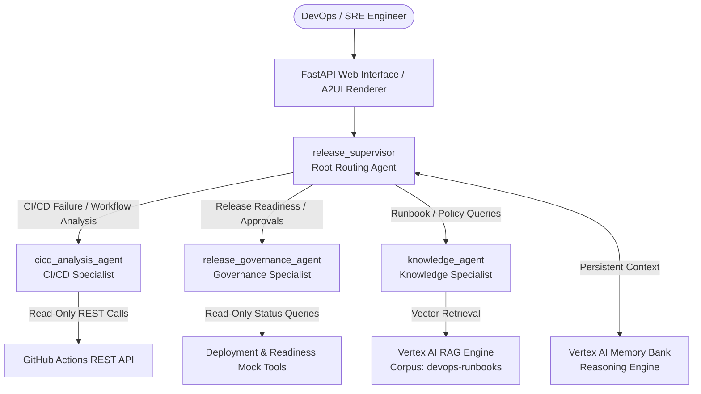

# 🚀 ReleaseOps AI: Enterprise Agentic AI DevOps Release Assistant

**ReleaseOps AI** is an enterprise-grade, multi-agent AI assistant designed to streamline DevOps release governance, automate CI/CD failure root-cause analysis, enforce production pre-requisites, and retrieve runbook procedures. Built with the **Google Agent Development Kit (ADK)**, **Gemini 2.5**, **Vertex AI RAG Engine**, **Vertex AI Memory Bank**, and deployed serverlessly on **Google Cloud Run**.

---

## 🏛️ Multi-Agent System Architecture



---

## 🤖 Agent Responsibilities

| Agent Name | Role | Responsibilities & Tools |
|---|---|---|
| `release_supervisor` | **Coordinator & Router** | Root routing agent. Analyzes incoming user requests and delegates to the appropriate specialist agent. Maintains persistent cross-session operational memory via Vertex AI Memory Bank. |
| `cicd_analysis_agent` | **CI/CD Failure Analyst** | Inspects failed GitHub Actions workflows, jobs, and step logs. Distinguishes evidence from inference and suggests safe remediation steps. Uses 8 read-only GitHub REST tools. |
| `release_governance_agent` | **Release & Policy Evaluator** | Verifies production release prerequisites, unit test coverage thresholds, security vulnerability scans, change freeze windows, and manager approvals. |
| `knowledge_agent` | **Runbook & Policy Specialist** | Grounded in official DevOps runbooks (Hotfix procedures, release checklists, rollback steps) via Vertex AI RAG Engine with local fallback search. |

---

## ☁️ Google Cloud & AI Platform Services Used

- **Google Cloud Run**: Managed serverless container deployment.
- **Vertex AI & Gemini 2.5 Flash**: Multi-agent reasoning and prompt synthesis.
- **Vertex AI RAG Engine**: Vector retrieval over indexed DevOps runbooks (`devops-runbooks`).
- **Vertex AI Reasoning Engine Memory Bank**: Persistent long-term memory across sessions.
- **Artifact Registry & Cloud Build**: Automated container image build and storage.

---

## 🔒 Security Boundaries & Governance

- **Read-Only GitHub Actions Integration**: GitHub tools perform HTTP `GET` requests only. Zero permissions to rerun workflows, merge PRs, push commits, or modify secrets.
- **Sensitive-Data Protection**: Automatic redaction (`sanitize_sensitive_data`) ensures GitHub personal access tokens (`ghp_...`), GCP credentials, and confidential environment variables are never stored in memory or exposed in agent outputs.
- **Non-Destructive Operations**: Production environment checks and runbook searches are strictly non-destructive.

---

## 🔧 Environment Variables

Set the following environment variables in your environment or Cloud Run configuration:

| Variable Name | Description | Example / Default |
|---|---|---|
| `GOOGLE_CLOUD_PROJECT` | Target GCP Project ID | `your-gcp-project-id` |
| `GOOGLE_CLOUD_LOCATION` | GCP Region for Vertex AI | `us-central1` |
| `GOOGLE_GENAI_USE_VERTEXAI` | Enable Vertex AI backend | `true` |
| `GITHUB_TOKEN` | Optional GitHub PAT for higher API rate limits | `ghp_...` |

---

## 💻 Local Setup & Execution Guide

### 1. Prerequisites
- Python 3.11+
- Google Cloud SDK (`gcloud`) authorized with Vertex AI permissions (`roles/aiplatform.user`)

### 2. Installation
```bash
# Clone repository
git clone https://github.com/<your-username>/buildwithgemini-session1.git
cd buildwithgemini-session1

# Install dependencies
pip install -r requirements.txt
```

### 3. Running the Local Web Server
```bash
export GOOGLE_CLOUD_PROJECT="your-gcp-project-id"
export GOOGLE_CLOUD_LOCATION="us-central1"
export GOOGLE_GENAI_USE_VERTEXAI="true"

# Launch FastAPI Web Server (Hosts UI and Agent Proxy)
python3 frontend/main.py
```
Open `http://localhost:8080` in your web browser.

---

## 🚀 Recreating & Deploying to Google Cloud Run

To deploy ReleaseOps AI to your own Google Cloud project:

```bash
# 1. Set GCP Project & Region
gcloud config set project <YOUR_GCP_PROJECT_ID>
gcloud config set region us-central1

# 2. Enable Required Cloud APIs
gcloud services enable \
  run.googleapis.com \
  cloudbuild.googleapis.com \
  artifactregistry.googleapis.com \
  aiplatform.googleapis.com \
  secretmanager.googleapis.com

# 3. Deploy Source Code Directly to Cloud Run
gcloud run deploy releaseops-ai \
  --source . \
  --region us-central1 \
  --platform managed \
  --allow-unauthenticated \
  --port 8080 \
  --cpu 2 \
  --memory 2Gi \
  --set-env-vars GOOGLE_CLOUD_PROJECT=<YOUR_GCP_PROJECT_ID>,GOOGLE_CLOUD_LOCATION=us-central1,GOOGLE_GENAI_USE_VERTEXAI=true
```

---

## 🧪 Production Validation Results

All 9 validation areas were verified against the deployed Cloud Run service endpoint with **100% PASS**:

| Area | Description | Verdict |
|---|---|---|
| **1. Health Check** | Verified `/health` endpoint returning status `healthy` and Memory Bank metadata. | **PASS** |
| **2. Multi-Agent Routing** | Verified `release_supervisor` routing to specialized agents. | **PASS** |
| **3. Real GitHub Actions** | Analyzed run `35428930729` in `ctssddevopsengineer/wedding-invitation-site`. Identified failed job `Pixel Visual Regression`. | **PASS** |
| **4. Release Readiness** | Evaluated `auth-service` in `UAT` returning `NOT_READY` with vulnerability blockers. | **PASS** |
| **5. Vertex AI RAG** | Retrieved Emergency Release Hotfix runbook procedures grounded in vector corpus. | **PASS** |
| **6. Memory Bank** | Recalled non-sensitive operational context (`auth-service` in `UAT`) across sessions. | **PASS** |
| **7. Sensitive Protection** | Verified secret tokens are sanitized and redacted from responses. | **PASS** |
| **8. API Stability** | HTTP 200 SLAs across static frontend and `/chat` endpoints with 0 server errors. | **PASS** |
| **9. Security Boundaries** | Verified all 11 registered tools are strictly read-only GET functions. | **PASS** |

---

## 📹 Video Demo

A video screen capture of the interactive agent UI in action is saved in the repository as `releaseops_ai_demo.webm`.
